<div align="center">

# 🏗️ Highly Available Multi-Tier Application Platform on AWS

### Self-Healing, Load Balanced, Auto Scaling Architecture with Docker, Amazon RDS, CloudWatch & Chaos Engineering Validation

[](https://aws.amazon.com/)
[](https://www.docker.com/)
[](https://nodejs.org/)
[](https://aws.amazon.com/rds/)
[](https://aws.amazon.com/cloudwatch/)
[](LICENSE)

**A self-healing, Multi-AZ application platform on AWS — a Dockerized Node.js app behind an Application Load Balancer and Auto Scaling Group, backed by Amazon RDS MySQL, monitored through CloudWatch, alerted via SNS, and validated through live chaos engineering testing.**

</div>

---

## 🏆 What This Project Demonstrates

This project was built to demonstrate real-world AWS High Availability and Reliability Engineering principles through the design, deployment, monitoring, and validation of a production-inspired application platform. The solution combines load balancing, multi-AZ application deployment, self-healing infrastructure, automated provisioning, monitoring, alerting, and chaos engineering practices to ensure application availability during infrastructure failures.

Unlike traditional single-server deployments, the platform is designed to maintain service continuity, automatically recover from failures, and provide operational visibility across all infrastructure layers.

| Skill Area | What I Built |
|---|---|
| 🏗️ High Availability | Multi-AZ application deployment with redundant application instances behind an Application Load Balancer |
| ☁️ AWS Architecture | VPC, ALB, Auto Scaling Group, Launch Templates, RDS, CloudWatch, SNS |
| ⚖️ Load Balancing | Application Load Balancer distributing traffic only to healthy targets |
| 🔁 Reliability Engineering | Auto Scaling Groups automatically replacing failed infrastructure |
| 🤖 Automated Provisioning | User Data bootstrap process that deploys application instances automatically |
| 🐳 Containerization | Dockerized Node.js application using multi-stage builds |
| 📊 Monitoring & Observability | CloudWatch Dashboard, Metrics, Alarms, and SNS Notifications |
| 🧪 Chaos Engineering | Live infrastructure failure simulation and automated recovery validation |

---

## ☁️ Cloud Architecture

<p align="center">
  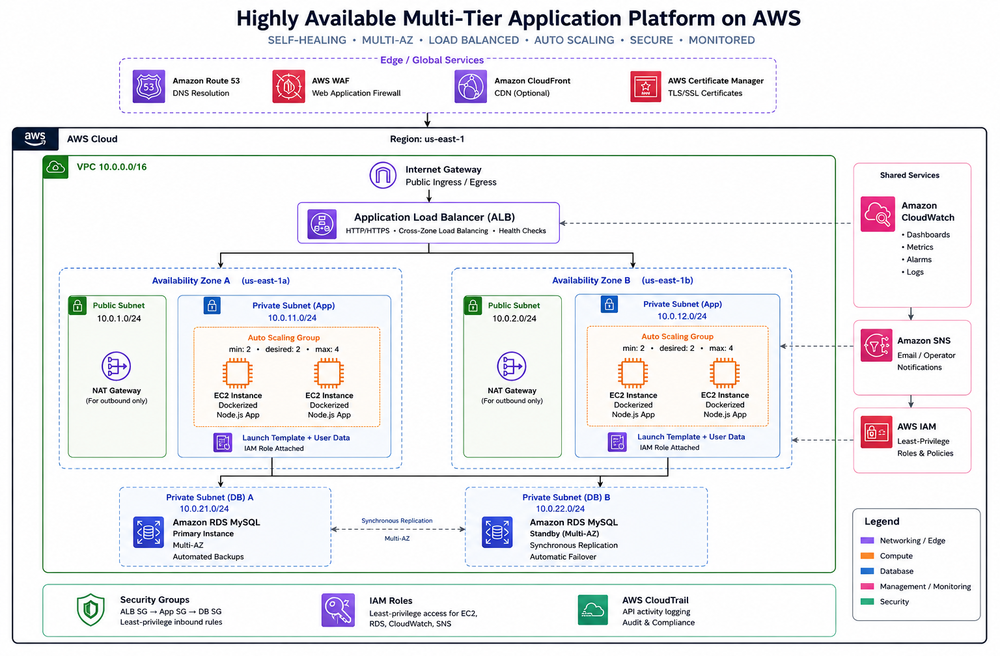
</p>

> The diagram above illustrates the target-state architecture this platform was engineered toward. Core High Availability components—including the Application Load Balancer, Auto Scaling Group, Multi-AZ application deployment, monitoring, alerting, and self-healing infrastructure—were fully deployed, tested, and validated through live failure simulations.

### Architectural Objectives

The platform was designed around two primary engineering goals:

#### 1. High Availability

Ensure application availability through:

- Multi-AZ application deployment
- Redundant application instances
- Load balancing
- Health-based traffic routing
- Elimination of application-layer single points of failure

#### 2. Reliability

Ensure infrastructure resiliency through:

- Automated failure detection
- Auto Scaling recovery
- Launch Template standardization
- Automated application provisioning
- Continuous health monitoring

The result is a platform capable of maintaining service availability while automatically recovering from infrastructure failures.

The architecture combines High Availability, Self-Healing Infrastructure, and Operational Visibility to create a resilient application platform.

Key design principles:

- Application availability is maintained through Multi-AZ deployment and load balancing.
- Infrastructure failures are automatically remediated through Auto Scaling Groups.
- Health checks continuously validate application availability.
- New instances are provisioned automatically through Launch Templates and User Data.
- Monitoring and alerting provide operational visibility across all infrastructure layers.
- Security Groups enforce strict communication boundaries between tiers.

---

## 🔄 Solution Flow

```
User
  │
  ▼
Application Load Balancer
  │
  ├──────────────┐
  ▼              ▼
EC2 (AZ-A)     EC2 (AZ-B)
  │              │
  └──────┬───────┘
         ▼
Dockerized Node.js Application
         │
         ▼
Amazon RDS MySQL (Private Subnet)
         │
         ▼
CloudWatch Monitoring
         │
         ▼
SNS Email Alerts
```

---

## 🛠️ Tech Stack

| Category | Tools |
|---|---|
| Cloud | AWS VPC, EC2, Application Load Balancer, Auto Scaling Group, Launch Templates, Amazon RDS, IAM |
| Monitoring & Reliability | CloudWatch Dashboards, CloudWatch Alarms, Amazon SNS, ALB Health Checks |
| Application | Node.js, Express.js, MySQL, HTML/CSS/JavaScript |
| Containers | Docker (Multi-Stage Build) |
| Testing | Chaos Engineering (manual instance termination) |

---

## 📁 Repository Structure

```
aws-ha-multitier-platform/
│
├── backend/
│   ├── config/
│   ├── routes/
│   ├── workers/
│   └── server.js
│
├── frontend/
│
├── database.sql
├── Dockerfile
├── docker-compose.yml
│
├── screenshots/
│  
│
└── README.md
```

---

## 📖 Implementation Walkthrough

### Step 1 — Network Foundation

A custom VPC was built from scratch to support a highly available, segmented architecture.

```
VPC
├── Public Subnet A (AZ-A)
├── Public Subnet B (AZ-B)
├── Private DB Subnet A (AZ-A)
├── Private DB Subnet B (AZ-B)
├── Internet Gateway
└── Route Tables
```

<p align="center">
  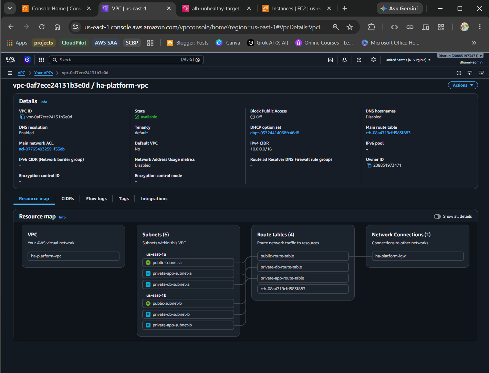
</p>

**Three-layer Security Group design:**

| Security Group | Allows |
|---|---|
| ALB-SG | HTTP (80) from the internet |
| App-SG | Port 3000 from ALB-SG only, SSH from admin IP only |
| DB-SG | MySQL (3306) from App-SG only |

This ensures the application is reachable only through the load balancer, and the database is reachable only from application instances — never directly from the internet.

<p align="center">
  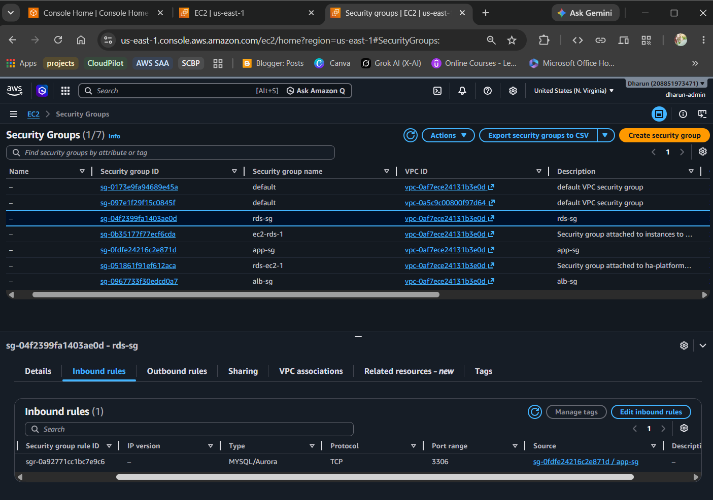
</p>

---

### Step 2 — Deploy the Database Layer

Amazon RDS MySQL was deployed as the managed database layer, fully isolated from public access.

```
Engine          : MySQL
Instance Type   : db.t3.micro
Deployment      : Private Subnet (Multi-AZ ready)
Public Access   : Disabled
```

<p align="center">
  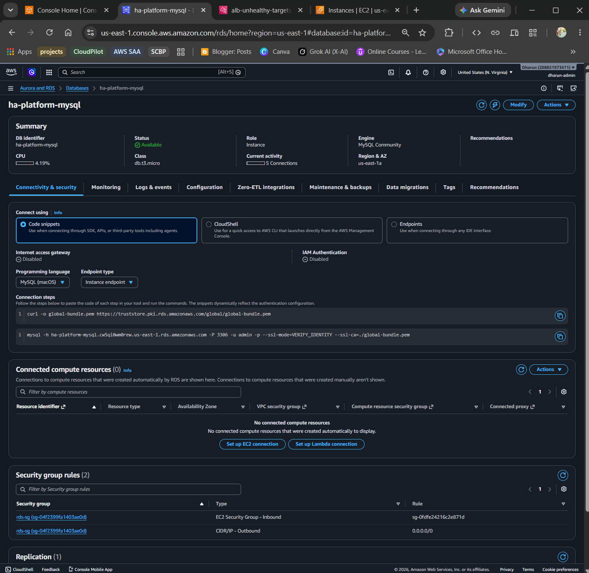
</p>

The database stores employee records, department data, and operational dashboard data — accessible exclusively through `App-SG`.

---

### Step 3 — Build & Containerize the Application

A custom **AWS Operations Dashboard** was built with Node.js and Express, designed to simulate real operational workloads — CPU stress testing, database-intensive operations, and live infrastructure metrics.

**Application Features:**
```
- Employee Management
- Department Management
- Operational Metrics
- CPU Stress Testing
- Database Stress Testing
- Infrastructure Monitoring Dashboard
```

<p align="center">
  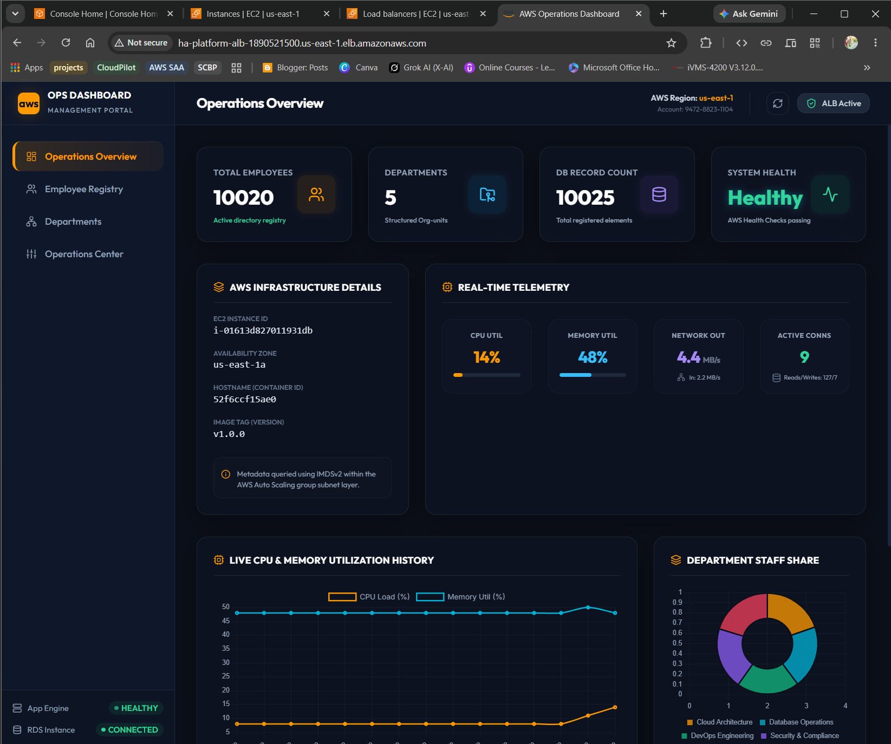
</p>

### Containerization Strategy

The application was containerized using a multi-stage Docker build process to create a lightweight and consistent production image.

Key benefits:

- Reduced image size
- Faster deployments
- Consistent runtime environment
- Simplified scaling across Auto Scaling Group instances
- Repeatable deployments across Availability Zones
---

### Step 4 — Application Load Balancer

An ALB was introduced in front of the application tier to distribute traffic and continuously verify instance health.

<p align="center">
  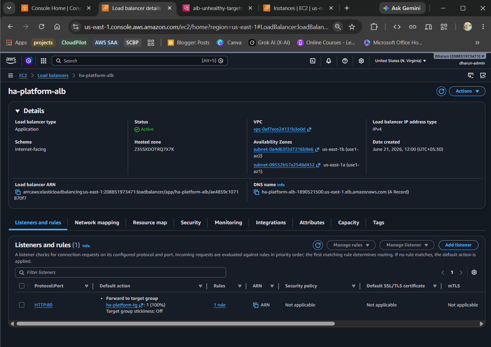
</p>

<p align="center">
  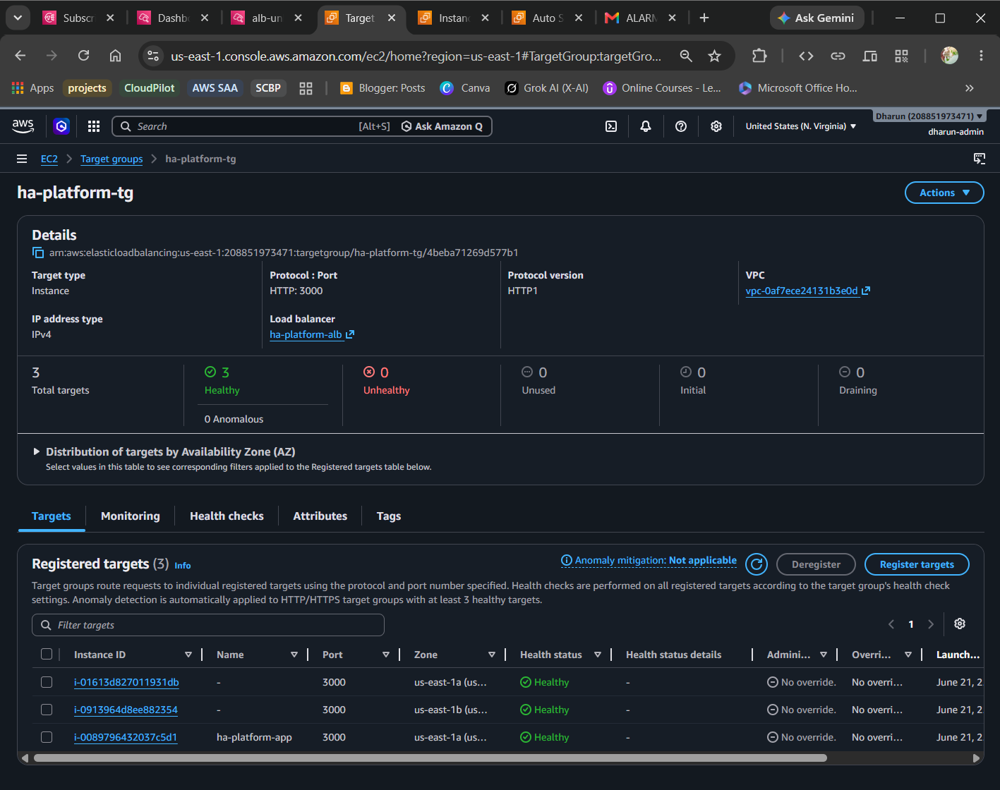
</p>

```
Health Check Path : /health
Behavior          : Unhealthy instances are automatically
                     deregistered from the target group
```

---

### Step 5 — Launch Templates & Automated Provisioning

Launch Templates standardize every instance the Auto Scaling Group creates — AMI, Security Group, IAM Role, and User Data are defined once and reused identically.

<p align="center">
  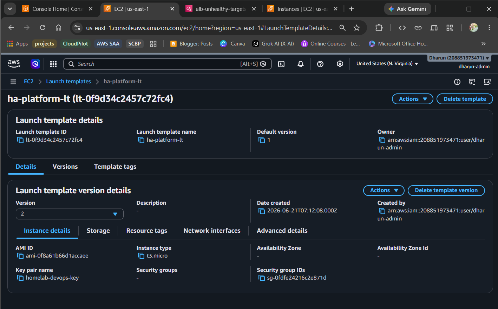
</p>

### Automated Instance Bootstrap

Every new Auto Scaling instance automatically:

1. Installs Docker
2. Installs Git
3. Clones the application repository
4. Generates environment configuration
5. Builds the Docker image
6. Starts the application container
7. Registers with the Application Load Balancer

This enables fully automated recovery and provisioning without manual intervention.

---

### Step 6 — Auto Scaling Group

The Auto Scaling Group provides the platform's self-healing capability.

| Setting | Value |
|---|---|
| Minimum Capacity | 2 |
| Desired Capacity | 2 |
| Maximum Capacity | 4 |
| Health Check Type | ELB |
| Multi-AZ Deployment | Enabled |

<p align="center">
  
</p>

---

### Step 7 — Monitoring & Observability

A centralized CloudWatch Dashboard surfaces operational health across every layer of the platform.

<p align="center">
  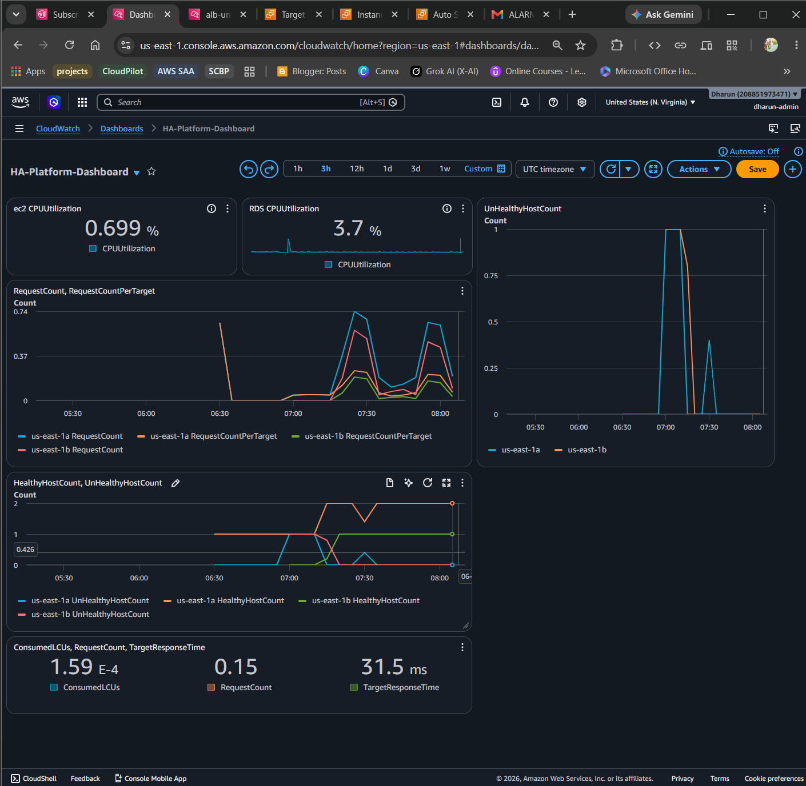
</p>

**Metrics monitored:**

| Layer | Metrics |
|---|---|
| Application Load Balancer | Request Count, Healthy Host Count, Unhealthy Host Count |
| Auto Scaling Group | Desired Capacity, In-Service Instances |
| EC2 | CPU Utilization |
| Amazon RDS | CPU Utilization, Database Connections |

---

### Step 8 — Alerting & Notifications

CloudWatch Alarms feed Amazon SNS to provide proactive notification before users notice degraded service.

```
ALB Healthy Host Alarm  → Triggers when HealthyHostCount < 2
EC2 High CPU Alarm      → Triggers when CPU Utilization > 70%
RDS High CPU Alarm      → Triggers when CPU Utilization > 70%
```

<p align="center">
  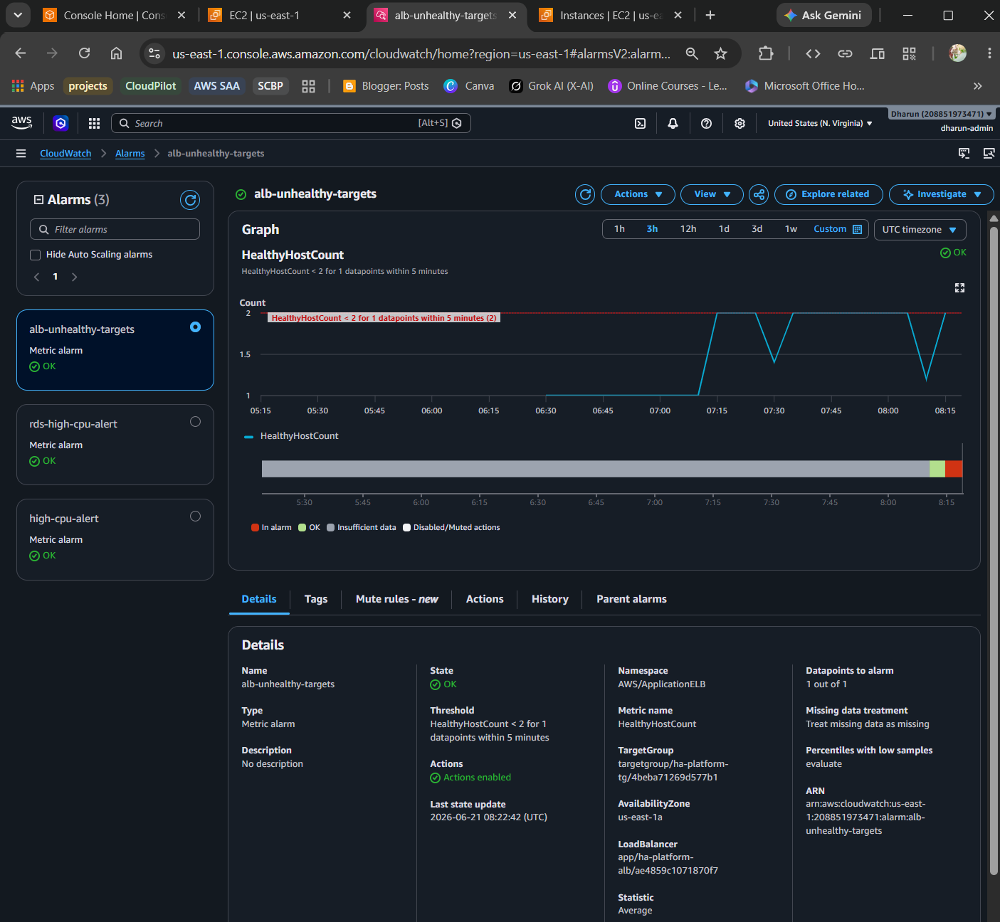
</p>

<p align="center">
  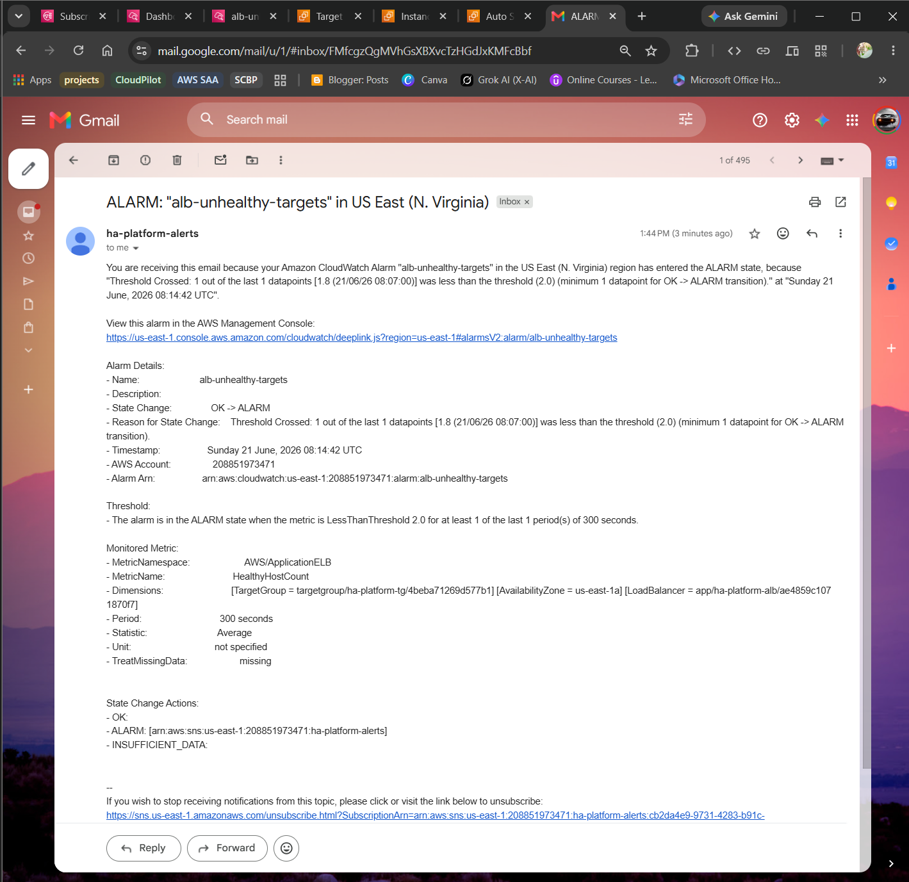
</p>

---

### Step 9 — Chaos Engineering Validation

To prove the platform actually self-heals — not just on paper — a live instance was manually terminated and the recovery was observed end-to-end.

**Before:** both instances healthy and in-service.

<p align="center">
  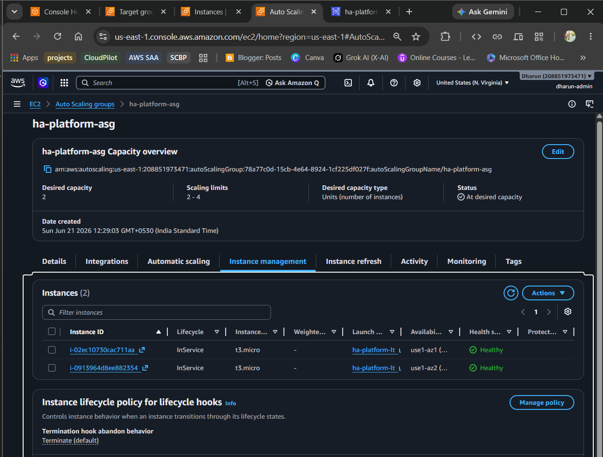
</p>

**During:** one Auto Scaling instance manually terminated.

<p align="center">
  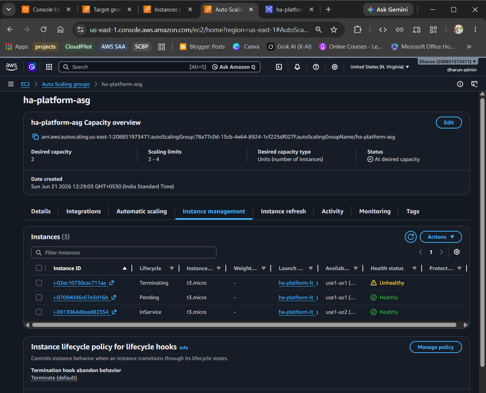
</p>

**After:** Auto Scaling Group detected the capacity loss and launched a replacement automatically.

<p align="center">
  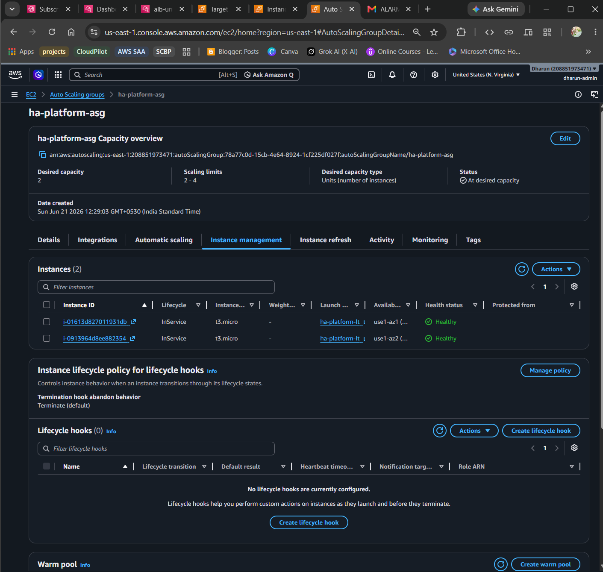
</p>

**Recovery Flow:**

```
Instance Failure
       │
       ▼
ASG Detection
       │
       ▼
Launch New EC2
       │
       ▼
Execute User Data
       │
       ▼
Deploy Docker Application
       │
       ▼
Register with ALB
       │
       ▼
Pass Health Checks
       │
       ▼
Restore Capacity
```

✅ **Result:** capacity was restored automatically — no manual intervention required.

---

## 🧠 Engineering Decisions

> Every design choice has a reason. These reflect real production reliability thinking — not defaults.

| Decision | Why |
|---|---|
| Application Load Balancer in front of all instances | Distributes traffic and removes unhealthy instances from rotation automatically — no single instance is a point of failure |
| Auto Scaling Group with ELB health checks | Detects and replaces failed infrastructure without human involvement |
| Launch Templates over manual AMI configuration | Every replacement instance is provisioned identically — no configuration drift between instances |
| Three-tier Security Group isolation | Each layer only accepts traffic from the layer directly in front of it — minimizes blast radius |
| RDS in private subnets, no public access | The database is structurally unreachable from the internet, not just access-controlled |
| Multi-stage Docker build | Keeps the production image lean and ensures the runtime environment is identical across every Auto Scaling instance |
| CloudWatch + SNS over manual log checking | Alerts reach the operator before users notice degraded service, not after |
| Live chaos test instead of assuming resilience | Self-healing claims are only credible once they're actually triggered and observed |

---

## 🐛 Real Problems Solved

These were actual blockers encountered and debugged during the build:

| Problem | Root Cause | Solution |
|---|---|---|
| Single point of failure in early design | Initial deployment used one EC2 instance behind no load balancer | Redesigned around ALB + Auto Scaling Group across two AZs |
| Instance failure required manual recovery | No automated replacement mechanism existed | Implemented Auto Scaling Group with Launch Template-based bootstrap |
| Uneven traffic distribution | Direct EC2 access bypassed any load balancing logic | Forced all traffic through ALB; locked App-SG to accept only ALB-SG |
| No visibility into infrastructure health | No centralized monitoring existed | Built a CloudWatch Dashboard aggregating ALB, ASG, EC2, and RDS metrics |
| Delayed incident awareness | Issues were only found when manually checking the console | Configured CloudWatch Alarms wired to SNS email notifications |
| Inconsistent new-instance configuration | Manual provisioning risked drift between instances | Standardized provisioning through Launch Templates + User Data automation |

---

## 📊 AWS Services Used

| Service | Role |
|---|---|
| Amazon VPC | Multi-AZ network isolation |
| Application Load Balancer | Public entry point, traffic distribution, health-based routing |
| Auto Scaling Group | Self-healing capacity management across AZs |
| Launch Templates | Standardized, repeatable instance provisioning |
| Amazon EC2 | Application compute |
| Amazon RDS (MySQL) | Managed, private database layer |
| Amazon CloudWatch | Dashboards and alarms across every layer |
| Amazon SNS | Email alerting on threshold breaches |
| AWS IAM | Least-privilege roles for EC2 instances |

---

## 🏗️ High Availability & Reliability (Primary Focus)

### High Availability

The platform was designed to maintain application availability through:

- Multi-AZ deployment
- Application Load Balancer
- Health-based traffic routing
- Redundant application instances
- Continuous availability validation

### Reliability

Infrastructure resiliency is achieved through:

- Automated failure detection
- Auto Scaling Group recovery
- Launch Template standardization
- User Data automation
- Self-healing infrastructure workflows

These capabilities were validated through a live chaos engineering exercise where an application instance was intentionally terminated and automatically replaced without manual intervention.

---

## 🏗️ AWS Well-Architected Alignment

**Operational Excellence**
CloudWatch Dashboards centralize visibility across the ALB, ASG, EC2, and RDS layers. SNS alarms ensure operators are notified proactively rather than discovering issues after the fact.

**Security**
Three-layer Security Group isolation ensures each tier only accepts traffic from the tier directly in front of it. RDS sits in private subnets with no public access path.

**Performance Efficiency**
The ALB and Auto Scaling Group allow capacity to flex between 2 and 4 instances based on demand, rather than over-provisioning for peak load permanently.

**Cost Optimization**
Desired capacity is set to the minimum needed for availability (2 instances across 2 AZs), with headroom to scale to 4 only when load actually requires it.

---

## 🎓 Skills Demonstrated

**AWS Cloud Services**

`Amazon VPC` `Amazon EC2` `Application Load Balancer` `Auto Scaling Group` `Launch Templates` `Amazon RDS` `AWS IAM` `Amazon CloudWatch` `Amazon SNS`

**Reliability Engineering**

`High Availability Design` `Multi-AZ Architecture` `Self-Healing Infrastructure` `Failure Recovery` `Chaos Engineering`

**DevOps & Containers**

`Docker` `Multi-Stage Builds` `Infrastructure Automation` `User Data Bootstrap` `Monitoring` `Alerting`

**Application Development**

`Node.js` `Express.js` `MySQL` `REST APIs`

---

## 🚀 Future Roadmap

- [ ] Multi-AZ RDS deployment for database-layer high availability
- [ ] Route 53 integration for custom domain routing
- [ ] HTTPS via AWS Certificate Manager (ACM)
- [ ] AWS WAF for application-layer protection
- [ ] NAT Gateway architecture for outbound-only private subnet access
- [ ] CI/CD pipeline integration (GitHub Actions)
- [ ] Terraform-based infrastructure provisioning
- [ ] Blue/Green deployment strategy

---

## 📝 Notes

This project was intentionally implemented using AWS Free Tier–compatible resources while preserving the core architectural principles of High Availability, Self-Healing Infrastructure, Automated Recovery, Monitoring, and Operational Visibility.

The architecture can be extended for enterprise-scale deployments through Multi-AZ databases, custom domains, HTTPS termination, WAF integration, Infrastructure as Code, and advanced deployment strategies.

---

<div align="center">

*Built end-to-end on AWS to demonstrate High Availability Architecture, Self-Healing Infrastructure, Automated Recovery, Operational Monitoring, and Reliability Engineering practices inspired by real-world cloud production environments.*

</div>

# 👨‍💻 Author

### Dharun R

AWS Cloud & DevOps Engineer

**Project:** Highly Available Multi-Tier Application Platform on AWS
